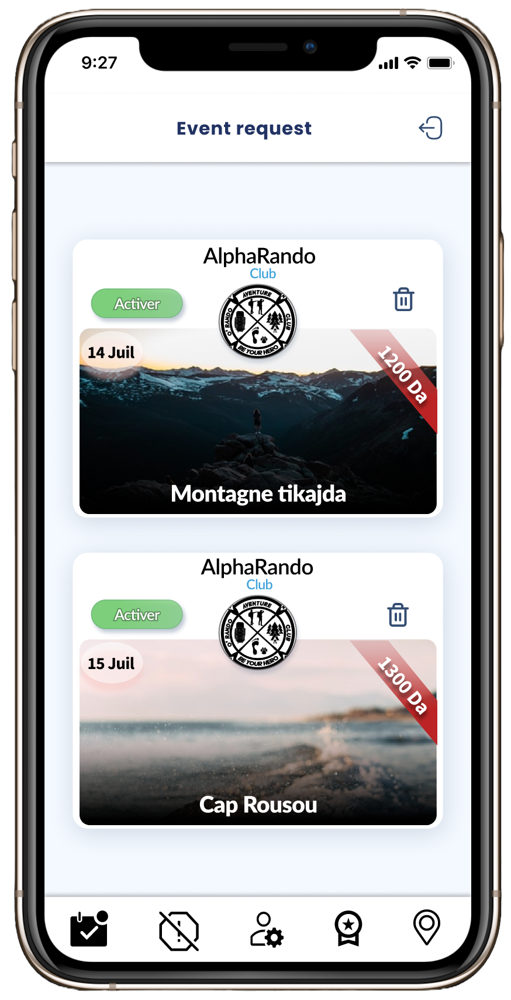
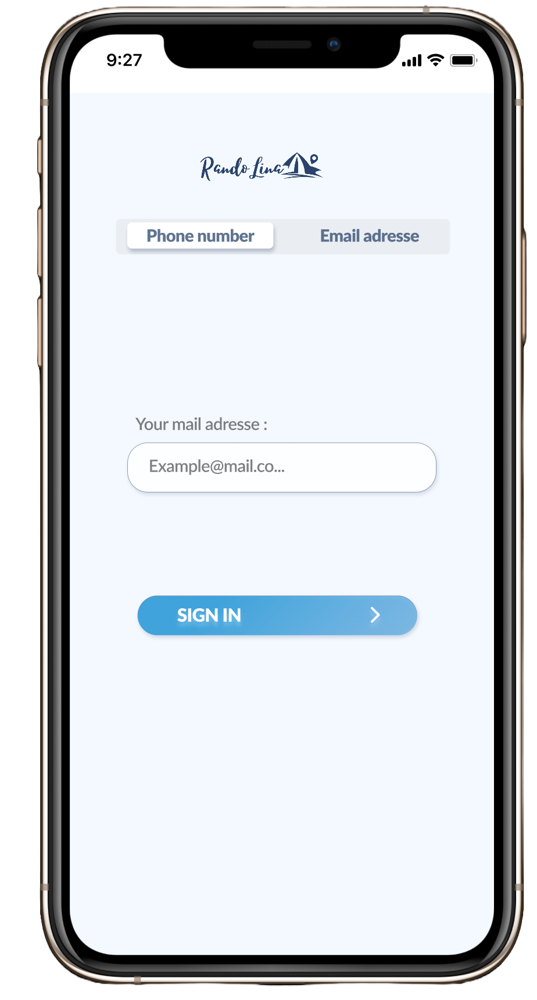
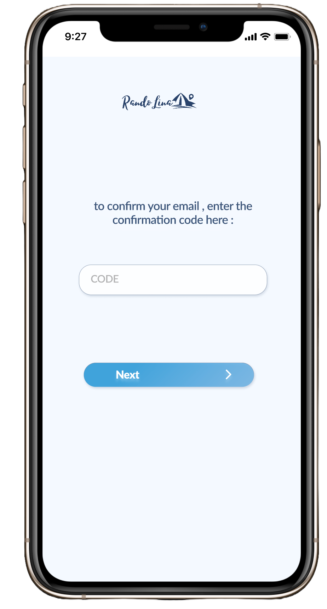
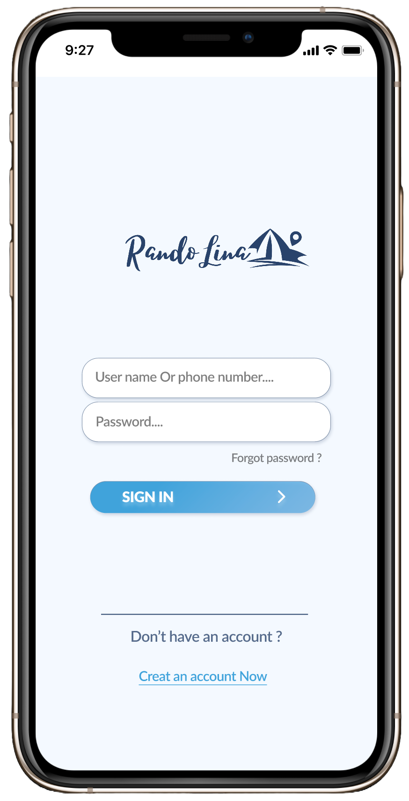
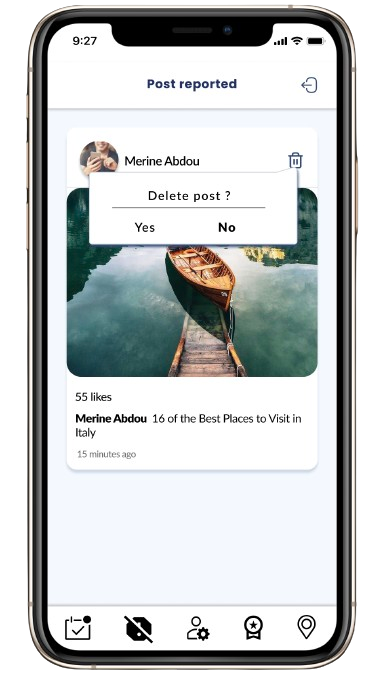

# Randolina - Flutter App

Randolina is a dynamic and interactive Flutter application designed to bring people together through social interactions and event participation. Users can connect with each other, follow clubs, and join various events organized by these clubs. This README provides an overview of the app's functionalities and guides you through its features and usage.
## Screenshots

  
  
  
  
  

## Features

### Social Interaction

#### Follow Users
- Users can follow each other similar to Instagram.
- Stay updated with the activities and events of the people you follow.
- Receive notifications when someone you follow posts an update or creates an event.

#### Like and Comment
- Engage with posts by liking and commenting on them.
- View the likes and comments on your posts in real-time.
- Get notifications when someone likes or comments on your posts.

### Event Participation

#### Register for Events
- Discover various events organized by clubs.
- Register for events seamlessly within the app.
- Receive reminders and notifications about upcoming events you’ve registered for.

### Clubs

#### Create and Manage Events
- Clubs are special user categories with additional functionalities.
- Create events with detailed descriptions, dates, and participant limits.
- Manage participant lists, approve or reject registrations, and send event updates.

#### Participant Management
- View and manage the list of participants registered for events.
- Send announcements or updates to all participants.
- Monitor event engagement and feedback from participants.
  
